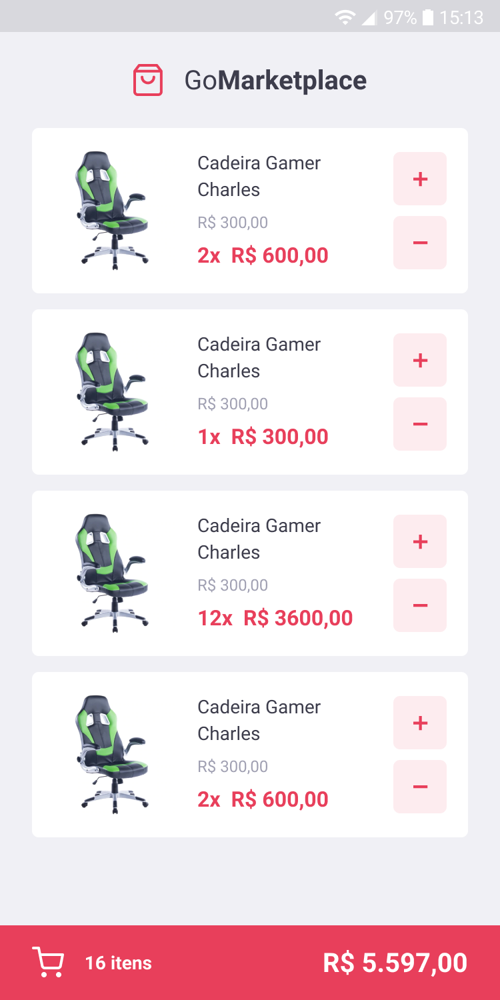

# Rocketseat

## Bootcamp GoStack #13

### Level 03 - Desafio: Fundamentos React Native

---

### GoMarketplace

#### Screen captures

  
  

---

- [Instruções do Desafio](https://github.com/rocketseat-education/bootcamp-gostack-desafios/tree/master/desafio-fundamentos-react-native)

- [Layout da aplicação - Figma](https://www.figma.com/file/VgK3hsmyGbqiGu9FdqfUzF/GoMarketplace?node-id=0%3A1)
